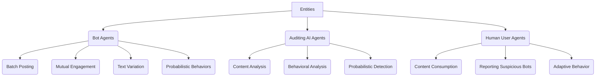
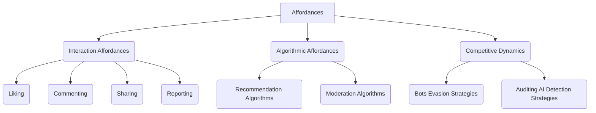
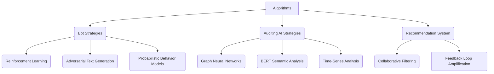
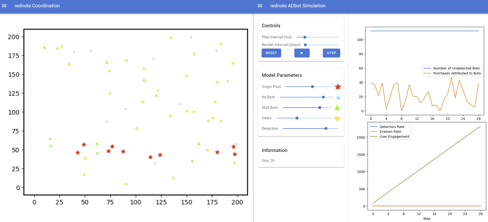

The Deliverable DEL 2.B The Proposal

# Title: Bots vs Guardians: Simulating Audits on Xiaohongshu (RedNote)
* Team members: Xintong (Sylvia) LING, Huanrui (Saikoro) CAO, Jiayi (Jaye) CHEN
* [GitHub repo URL](https://github.com/EECS4461/Group8):  [https://github.com/EECS4461/Group8](https://github.com/EECS4461/Group8)

---
## Section 1: Phenomena of interest.

Our project focuses on the commenting ecology of automated robots (bots) on the Chinese social media and e-commerce platform Xiaohongshu (RedNote). Automated bots often appear under posts containing specific keywords, especially in areas related to logistics and specific product categories. These bots often coordinate their actions to promote advertisements, counterfeit goods, and services such as fortune-telling.

Xiaohongshu (RedNote) is a rapidly growing platform with over 200 million monthly active users, combining social media features with e-commerce. It is widely used in China for product recommendations, lifestyle sharing, and community discussions, making it an attractive target for automated bots aiming to manipulate content and trends.

Our simulation aims to explore the dynamics of bot-generated content and content moderation mechanisms on Xiaohongshu (RedNote). The core phenomena of interest include:

* Influence of Bots on Content Visibility: How AI-driven social bots manipulate trends, inflate engagement metrics, and shape public opinion.
* Human-Bot Interaction Dynamics: The interplay between human users and bots, including content creation, sharing, and reactions.
* Effectiveness of Content Moderation: The role of moderation algorithms in detecting, limiting, or removing manipulative content.

We seek to understand how these phenomena evolve through simple agent-based interactions, leading to emergent behaviours similar to flocking dynamics in the Boid model.

## Section 2: Phenomena of interest.

To demonstrate the evolving challenges facing social media bot detection, we revisit the core phenomenon of our interest, the dynamic interplay between bot behavioural patterns and community structure in online networks, and consolidate this discussion with critical analyses of two important scholarly works.

Chen et al. (2024) introduce CACL, a framework for detecting social media bots using community-aware heterogeneous graph contrastive learning. The authors address the challenge of identifying bots in complex social networks by leveraging heterogeneous graph structures and contrastive learning techniques. CACL incorporates community information to enhance detection accuracy, as bots often exhibit distinct behaviours within communities. The proposed method outperforms existing approaches by effectively capturing both local and global patterns in the graph. The paper demonstrates the effectiveness of CACL through extensive experiments on real-world datasets, highlighting its potential for improving bot detection in social media platforms.

The article "Detecting Social Media Bots with Variational AutoEncoder and k-Nearest Neighbor" by Wang et al. (2021) proposes a method for identifying social media bots. The study introduces a detection framework that combines Variational AutoEncoders (VAE) with the k-Nearest Neighbor (k-NN) algorithm. The VAE is utilized to learn a compressed representation of user data, capturing essential features that distinguish genuine users from bots. Then the k-NN algorithm is applied to these representations to classify users based on their proximity to known bot or human profiles. Experimental results demonstrate that this hybrid approach enhances detection accuracy compared to traditional methods, offering a promising solution for mitigating the influence of bots on social media platforms.

### References

> Chen, S., Feng, S., Liang, S., Zong, C.-C., Li, J., & Li, P. (2024, June 3). *CACL: Community-aware heterogeneous graph contrastive learning for social media bot detection*. arXiv.org. https://arxiv.org/abs/2405.10558
>
> Wang, X., Zheng, Q., Zheng, K., Sui, Y., Cao, S., & Shi, Y. (2021, June 13). *Detecting social media bots with variational AutoEncoder and K-nearest neighbor*. MDPI. https://www.mdpi.com/2076-3417/11/12/5482

## Section 3: Describe the Core Components of the Simulation

### Association with Mesa Examples

Among the four examples provided by Mesa, our simulation is closest to the Boid Flockers model. The Boid model demonstrates how individuals form complex group behaviors based on simple local rules (such as cohesion, separation, alignment), similar to the interactive dynamics between bots and users on social platforms. We are using this model as an analogy for the collective manipulation behaviors of social bots on the platform, the natural reactions of human users, and the intervention mechanisms of auditing AI.

### §3.1 Entities:

- Bot Agents:
  - Role: Automated entities on social media responsible for posting advertisements, manipulating content credibility, and evading audit detection.
  - Goal: To increase the visibility and credibility of advertising content, driving user engagement and conversions.
  - Behavior:
    - Batch Posting: Post comments synchronously to simulate natural discussions and increase visibility.
    - Mutual Engagement: Bots like and comment on each other to create false popularity.
    - Text Variation: Generate diverse comments to evade audit algorithms.
    - Probabilistic Behaviors: Use probabilistic models to simulate the success rate of bots evading detection.
- Auditing AI Agents:
  - Role: Content auditing algorithms responsible for detecting and removing bot-generated content.
  - Goal: Efficiently detect and remove bot content, reducing false positive rates.
  - Behavior:
    - Content Analysis: Detect repetitive patterns and abnormal text features.
    - Behavioral Analysis: Analyze account activity frequency and interaction patterns.
    - Probabilistic Detection: Adjust the success rate of detection through probabilistic models to reflect the dynamic evolution of algorithms.
- Human User Agents:
  - Role: Real users on the platform who may be influenced by bots and can also participate in content auditing (e.g., reporting suspicious content).
  - Goal: To obtain genuine and valuable information, and engage in social interactions.
  - Behavior:
    - Content Consumption: Browse and like comments, interacting based on the credibility of content.
    - Reporting: Discover and report suspicious bots, assisting auditing AI in content management.
    - Adaptive Behavior: Users may adjust their interaction strategies based on the prevalence of bots.

### §3.2 Affordances:

- Interaction Affordances:
  - Liking, Commenting, Sharing, Reporting: These basic behaviors determine the breadth and depth of content dissemination.
  - Recommender Feedback: Highly interactive content may be prioritized by algorithms for recommendation, forming a feedback loop.
- Algorithmic Affordances:
  - Recommendation Algorithms: Recommend content based on user behavior data, which can be manipulated by bots.
  - Moderation Algorithms: Detect bot activity through text analysis and behavioral pattern recognition.
    Competitive Dynamics:
  - Bots vs. Auditing AI: Bots continuously optimize strategies to evade detection, while auditing AI continuously adjusts algorithms to improve detection success rates.

### §3.3 Algorithms:

* **Bot Strategies:**
  * **Reinforcement Learning (RL):** Learn optimal posting times and interaction strategies to maximize content dissemination effectiveness.
  * **Generative Adversarial Networks (GANs):** Generate diverse text to evade keyword-based detection.
  * **Probabilistic Behavior Models:** Use probabilistic models to simulate the success rate of bots evading detection.
* **Auditing AI Strategies:**
  * **Graph Neural Networks (GNNs):** Analyze social network structures to detect abnormal interaction patterns.
  * **BERT-based Semantic Analysis:** Identify diverse texts with potential promotional intent.
  * **Time-Series Analysis:** Detect abnormal posting time patterns and identify potential bot activity.
* **Recommendation System:**
  * **Collaborative Filtering:** Recommend content based on user behavior data, which may be amplified by bot activity.
  * **Feedback Loop:** Bots enhance content popularity through fake interactions, forming a recommendation amplification effect within the platform.

## Section 4: Anticipated Simulation Outcomes

### Anticipated Simulation Output & Metrics:

Our simulation output will reference Mesa's Boid Flockers model, using a 2D grid to visualize the dynamic interactions of bots, auditing AI, and human users on the Xiaohongshu platform.

### Visualization Components:

* **Agent Representation:**
  * **Bots (Red Circles):** Represent automated bots, with size varying according to activity frequency.
  * **Auditing AI (Blue Shields):** Represent auditing algorithms, distributed in the grid to detect and remove suspicious agents.
  * **Human Users (Green Circles):** Represent real users, displaying their interaction behaviors with content.
* **Dynamic Heatmap:**
  * Display interaction density in different areas through a heatmap, with red indicating high interaction areas and blue indicating low interaction areas.
* **Moderation Visualization:**
  * When auditing AI successfully detects a bot, the corresponding icon turns gray or disappears, displaying the detection success rate in real-time.

### Key Metrics:

* **Number of Undetected Bots:** Track the number of bots on the platform that remain unidentified.
* **Purchases Attributed to Bots:** Simulate the potential impact of bot promotional activities on sales.
* **User Engagement Metrics:** Track the liking, commenting, and sharing behaviors of real users.
* **Detection vs. Evasion Rates:** Show the probabilistic changes in bot detection and successful evasion rates.

### Preliminary Sketch:

* **2D Grid Display:** Similar to the visualization of the Boid Flockers model, displaying the dynamic distribution of bots and users.
* **Real-time Line Graphs:** Display changes in bot detection rate, user engagement, and content dissemination trends over time.
* **Feedback Loop Diagram:** Illustrate the dynamic feedback mechanism between bots and the recommendation system, and how it amplifies the impact of fake interactions.

Through these visualizations and data tracking, observers can intuitively understand the complex interactive relationships between bots, auditing AI, and human users, and their impact on the platform ecosystem.
