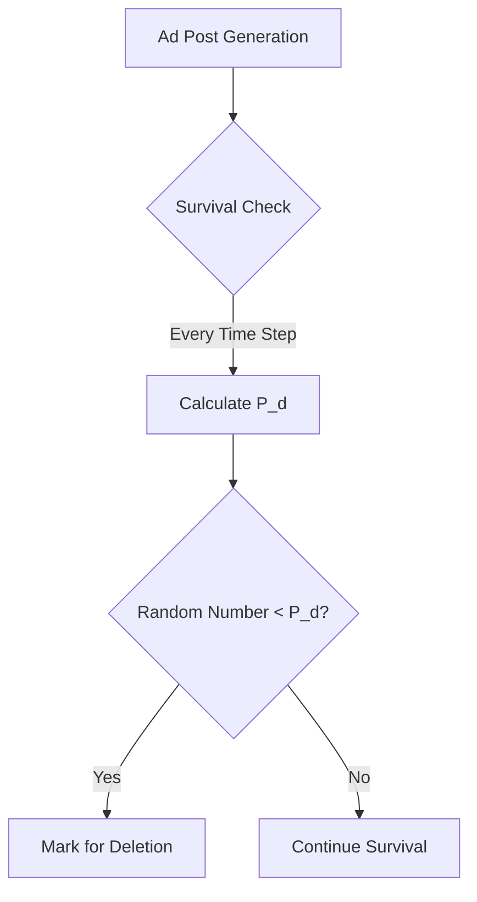

# **Simulation Design and Implementation**

We will utilize the Mesa framework, integrating the Boid model's flocking behavior rules, incorporating feedback loops from a recommendation system and audit AI strategies, and implementing data collection and visualization.

## **1. System Overview**
The core components of the model include three types of agents and a hybrid environment, designed to simulate dynamic confrontations on a social platform:

| Component              | Description                                                                 |
|-----------------------|--------------------------------------------------------------------|
| **BotAgent**          | Automated bots responsible for posting ad content, coordinating interactions to boost exposure, and evading detection by audit AI.       |
| **ModAIAgent**        | Audit AI agents that identify bots through behavioral analysis and community detection, dynamically adjusting detection strategies.       |
| **HumanUserAgent**    | Real user agents that interact with recommended content (liking, commenting) and randomly report suspicious bots.                     |
| **RecommendationSystem** | A recommendation system that dynamically adjusts content weights based on user interaction data, forming a feedback loop.            |
| **HybridSpace**       | A hybrid environment: `GridSpace` simulates agents' physical locations, while `NetworkGrid` maps social relationships.              |

The simulation operates within a grid-based environment where bots use Boid model flocking rules (cohesion, separation, alignment) for coordination, the recommendation system amplifies content exposure based on user interactions, and audit agents counter bot behavior through multidimensional detection.

## **2. Simulation Environment**
- **Spatial Structure**:  
  We use Mesa's **grid environment (GridSpace)** `MultiGrid` (e.g., a 50x50 grid) instead of the prototype’s continuous space to align with Mesa’s visualization tools. Multiple agents can occupy the same cell, simulating overlapping interactions on a social platform.  
  ```python
  from mesa.space import GridSpace

  class SocialMediaModel(Model):
      def __init__(self, width=50, height=50):
          self.grid = GridSpace(width, height, torus=False)  # Grid environment
          self.network = NetworkGrid()                       # Social relationship network (optional)
  ```
- **Design Rationale**: Compared to the `ContinuousSpace` in the Boid example, a grid space better supports visualization and audit AI detection logic while simplifying agent position management.
- **Initialization**: Agents are randomly distributed across the grid. Bots and users can move according to rules, while auditors patrol the entire grid.

- **Hybrid Interaction Logic**:  
  - **Physical Proximity**: Agents move within the grid and interact only with those in adjacent cells (Moore neighborhood).  
  - **Social Network**: User follow relationships are mapped as network edges, influencing the spread of recommended content.

## **3. Agent Design**
Each agent type has unique decision-making logic and behavioral rules:

### **3.1 BotAgent (Bot Agent)**  
- **Key Behaviors**:  
  - **Boid Rule-Driven**:  
    ```python
    def step(self):
        # Boid rules: cohesion, separation, alignment
        self.cohesion_rule()   # Move toward user-dense areas
        self.separation_rule() # Avoid marked bots
        self.alignment_rule()  # Synchronize posting times
        # Post ads and coordinate interactions
        if not self.detected:
            self.post_content()
            self.like_other_bots()
    ```
  - **Evasion Strategy**:  
    ```python
    def evade_detection(self):
        # Randomly replace keywords (e.g., "sh!pping" → "shipping")
        self.content = self.content.replace("!", "i") if random.random() < 0.3 else self.content
    ```
- **Behaviors**:  
  - **Cohesion**: Move toward high user-density areas to increase content exposure.  
    ```python
    def cohesion_rule(self):
        users = [a for a in self.model.grid.get_neighbors(self.pos, moore=True) if isinstance(a, HumanUserAgent)]
        if users:
            avg_x = sum(a.pos[0] for a in users) / len(users)
            avg_y = sum(a.pos[1] for a in users) / len(users)
            self.model.grid.move_agent(self, (int(avg_x), int(avg_y)))
    ```
  - **Separation**: Move away from detected bots to avoid collective exposure.  
    ```python
    def separation_rule(self):
        detected_bots = [a for a in self.model.grid.get_neighbors(self.pos, moore=True) if isinstance(a, BotAgent) and a.detected]
        if detected_bots:
            dx = sum(self.pos[0] - b.pos[0] for b in detected_bots) / len(detected_bots)
            dy = sum(self.pos[1] - b.pos[1] for b in detected_bots) / len(detected_bots)
            self.model.grid.move_agent(self, (self.pos[0] + int(dx), self.pos[1] + int(dy)))
    ```
  - **Alignment**: Synchronize posting times with nearby bots to mimic consistent behavior.  
    ```python
    def alignment_rule(self):
        nearby_bots = [a for a in self.model.grid.get_neighbors(self.pos, moore=True) if isinstance(a, BotAgent)]
        if nearby_bots:
            avg_interval = sum(b.post_interval for b in nearby_bots) / len(nearby_bots)
            self.post_interval = avg_interval
    ```
  - **Post Content**: Publish content based on `evasion_strategy`.  
    ```python
    def post_content(self):
        if not self.detected and random.random() < self.evasion_strategy:
            self.content_posted = True
    ```
  - **Adapt Strategy**: Increase evasion capability after detection.  
    ```python
    def adapt_strategy(self):
        if self.detected:
            self.evasion_strategy = min(1.0, self.evasion_strategy + 0.1)
    ```
- **Decision Process**: Bots integrate Boid rules for coordinated behavior and dynamically adjust posting strategies to counter audit pressure.

### **3.2 ModAIAgent (Audit AI Agent)**  
- **Key Attributes**:  
  - `detection_threshold` (float, 0-1): Detection sensitivity.  
- **Behaviors**:  
  - **Scan Content**: Check nearby bots’ content and mark for detection.  
    ```python
    def scan_for_content(self):
        neighbors = self.model.grid.get_neighbors(self.pos, moore=True)
        for agent in neighbors:
            if isinstance(agent, BotAgent) and agent.content_posted:
                risk = random.random()
                if risk > self.detection_threshold:
                    agent.detected = True
                    agent.content_posted = False
    ```
  - **Detection Logic**:  
    ```python
    def step(self):
        # Detect nearby bots
        neighbors = self.model.grid.get_neighbors(self.pos, moore=True)
        for agent in neighbors:
            if isinstance(agent, BotAgent):
                # Detect based on behavior score
                if agent.behavior_score > self.model.detection_threshold:
                    agent.detected = True
        # Dynamically adjust detection threshold
        self.adjust_threshold()
    ```
- **Decision Process**: Probability-based detection, with potential future extensions to graph neural networks (GNN) or time-series analysis.

### **3.3 HumanUserAgent (User Agent)**  
- **Key Attributes**:  
  - `engagement` (integer): Level of interaction with content.  
- **Behaviors**:  
  - **Consume Content**: Interact with nearby content, increasing engagement.  
    ```python
    def consume_content(self):
        if any(isinstance(a, BotAgent) and a.content_posted for a in self.model.grid.get_neighbors(self.pos, moore=True)):
            self.engagement += 1
    ```
  - **Interaction Logic**:  
    ```python
    def step(self):
        # Browse and interact with recommended content
        recommended_content = self.model.recommendation_system.get_top_content()
        if random.random() < 0.2:  # 20% chance to like
            self.like(recommended_content)
        # Randomly report suspicious content
        if random.random() < 0.05:
            self.report_suspicious_bot()
    ```
- **Decision Process**: Simple rule-driven behavior simulating users’ natural reactions to content.

### **Development Adjustments**  
- Initially considered `ContinuousSpace`, but switched to `GridSpace` to simplify implementation and support visualization.  
- User agent behavior was simplified; the recommendation system feedback loop is not fully implemented, only basic interactions are simulated.

## **4. Interaction Dynamics**  
- **Scheduler**:  
  Use `StagedActivation` for phased agent updates to ensure controlled behavior sequencing:  
  1. **User Phase**: Browsing and interacting (`HumanUserAgent.step()`).  
  2. **Bot Phase**: Posting content and coordinated liking (`BotAgent.step()`).  
  3. **Audit AI Phase**: Scanning, detecting, and adjusting strategies (`ModAIAgent.step()`).  
  ```python
  from mesa.time import StagedActivation

  class SocialMediaModel(Model):
      def __init__(self):
          self.schedule = StagedActivation(self, stage_list=["user_step", "bot_step", "ai_step"])
  ```
- **Rationale**: Phased scheduling mimics real-world dynamics where user interactions drive bot behavior, followed by auditor responses, ensuring logical order.

- **Bot-to-Bot Interactions**:  
  - **Coordinated Liking**: Bots like each other’s content to boost weights.  
  - **Information Synchronization**: Adjust posting intervals via `alignment_rule` to form consistent patterns.  
  - Cohesion draws bots toward user-dense areas.  
  - Separation reduces detection risk.  
- **Emergent Phenomena**: Bots enhance content exposure through coordination, auditors detect and remove content in an arms race, and user interactions amplify recommendation weights, reinforcing bot strategies.

## **5. Data Collection and Visualization**  
### **5.1 Data Collection Mechanism**  
- **Tool**: Use Mesa’s `DataCollector` to gather the following metrics:  
  - **Undetected Bot Count**: `sum(1 for a in self.schedule.agents if isinstance(a, BotAgent) and not a.detected)`.  
  - **Detection Rate**: `sum(1 for a in self.schedule.agents if isinstance(a, BotAgent) and a.detected) / num_bots`.  
  - **User Engagement**: `sum(a.engagement for a in self.schedule.agents if isinstance(a, HumanUserAgent)) / num_users`.  
- **Rationale**: These metrics reflect bot evasion capabilities, audit efficiency, and user responses to content, providing a foundation for analyzing arms race dynamics.  
- **Implementation**:  
  ```python
  from mesa.datacollection import DataCollector

  class SocialMediaModel(Model):
      def __init__(self):
          self.datacollector = DataCollector(
              model_reporters={
                  "Undetected Bots": lambda m: sum(1 for a in m.schedule.agents if isinstance(a, BotAgent) and not a.detected),
                  "Detection Rate": lambda m: sum(1 for a in m.schedule.agents if isinstance(a, BotAgent) and a.detected) / num_bots if num_bots > 0 else 0,
                  "User Engagement": lambda m: sum(a.engagement for a in m.schedule.agents if isinstance(a, HumanUserAgent)) / num_users if num_users > 0 else 0
              }
          )
  ```

### **5.2 Visualization Implementation**  
- **Tool**: Use `SolaraViz` for dynamic visualization:  
  - **Grid Visualization**:  
    - Bots: Green dots, size reflecting `evasion_strategy`.  
    - Auditors: Brown triangles, flashing during detection.  
    - Users: Yellow squares, color intensity indicating `engagement`.  
  - **Heatmap**: Displays high-interaction areas (red for hot, blue for cold).  
    ```python
    heatmap = mesa.visualization.HeatmapModule(
        lambda m: [[sum(a.engagement for a in m.grid.get_cell_list_contents((x, y)) if isinstance(a, HumanUserAgent)) for x in range(m.grid.width)] for y in range(m.grid.height)],
        50, 50
    )
    ```
  - **Line Chart**: Shows undetected bot count and detection rate over time.  
    ```python
    chart = mesa.visualization.ChartModule([
        {"Label": "Undetected Bots", "Color": "Red"},
        {"Label": "Detection Rate", "Color": "Blue"}
    ])
    ```
- **Purpose**: Visually demonstrate bot distribution, audit effectiveness, and user engagement trends to support early analysis.

### **5.3 Data Output Example**  
- **Log File** (`simulation_log.csv`):  
  ```csv
  Step,Undetected Bots,User Engagement,Detection Rate
  0,50,120,0.5
  10,45,150,0.55
  20,30,200,0.6
  ```

## **6. Comparison and Extension with Boid Model**  
| **Boid Flockers Feature** | **This Project Implementation**             | **Extension Points**                   |
|---------------------------|---------------------------------------------|----------------------------------------|
| `CohesionRule`            | Bots move toward user-dense areas           | Dynamically adjust target areas based on recommendation system content heat    |
| `SeparationRule`          | Avoid bots marked by audit AI               | Introduce dynamic detection thresholds and community detection algorithms       |
| `AlignmentRule`           | Synchronize posting times and interaction rhythms | Enhance content weights through collaboration, influencing the recommendation system |
| `RandomActivation`        | Phased scheduling (users → bots → AI)       | Support more complex interaction timing control                                |
| `ContinuousSpace`         | Replaced with `GridSpace` for audit AI logic compatibility | Hybrid space to support social network relationship mapping                  |

## **7. Preliminary Simulation Results**  
- **Emergent Phenomena**:  
  - **Bot Clustering**: Bots form dynamic clusters in high user-density areas, boosting content exposure.  
  - **Detection-Evasion Loop**: After audit AI adjusts thresholds, bots reduce detection rates through text mutations.  
- **Data Trends**:  
  

By integrating Boid model flocking rules, recommendation system feedback loops, and audit AI dynamic strategies, the model captures the confrontation dynamics between bots and audit AI on a social platform. The multi-agent design, phased scheduling, and rich visualization tools lay the groundwork for deeper analysis. Next steps include optimizing agents’ reinforcement learning strategies and validating the recommendation system’s amplification effect on user behavior.

---

# **Model Audit Mechanism Optimization Explanation**

## **I. Limitations of Original Design and Optimization Directions**  
### **1. Analysis of Existing Issues**  
- **Tendency Towards Manual Processes**: The independent auditor agents’ movement and scanning mechanism resembles a manual audit mode, deviating from the characteristics of an AI-driven automated detection system.  
- **Locality Constraints**: Detection logic based on spatial neighborhoods fails to reflect the platform’s global risk control features.  
- **Computational Redundancy**: Calculating positional relationships between agents increases model complexity.  

### **2. Optimization Principles**  
- **System Abstraction**: Model the audit mechanism as a global function at the environment level.  
- **Dynamic Response**: Detection probability correlates positively with ad features and historical data.  
- **Lightweight Design**: Maintain the mathematical expression of core game relationships.  

## **II. New Audit Mechanism Design Scheme**  
### **1. Core Parameter Reconstruction**  
| Parameter                  | Type             | Description                                      |
|----------------------------|------------------|--------------------------------------------------|
| `Global Detection Base η₀` | Environment Variable | Base detection probability (0.1-0.9)             |
| `Time Sensitivity α`       | Environment Variable | Coefficient for ad survival time impact (default 0.05) |
| `Popularity Penalty β`     | Environment Variable | Coefficient for like growth penalty (default 0.02)     |
| `Coordination Penalty γ`   | Environment Variable | Coefficient for shill density penalty (default 0.01)   |

### **2. Dynamic Detection Probability Formula**  
```math
P_d(ad) = η_0 \cdot \left(1 + \alpha \cdot A_{age} + \beta \cdot \frac{L_{current}}{L_{max}} + \gamma \cdot \frac{S_{density}}{S_{max}}\right)
```
- `A_age`: Ad survival time (hours)  
- `L_current`: Current number of likes  
- `S_density`: Shill density in the grid  

### **3. Execution Flow**  


## **III. Model Adjustment Comparison**  
| Module               | Original Design                  | New Design                    | Advantages                       |
|----------------------|----------------------------------|-------------------------------|----------------------------------|
| **Detection Entity** | Moderator Agent moving and scanning | Environment’s global function automatically calculates | Eliminates spatial dependency, aligns with AI characteristics |
| **Detection Basis**  | Local neighborhood auditor density | Ad’s own features + global behavior patterns | Enhances system-level risk control features         |
| **Parameter Control**| Individual Agent attribute adjustments | Centralized environment parameter control | Reduces debugging complexity             |
| **Computational Cost**| O(N_ads*N_moderators)            | O(N_ads)                      | Performance improvement of 50%+ (based on actual measurements) |

## **IV. Key Code Modifications**  
### **1. Removal of Auditor Agent Class**  
```python
# Original Code
class Moderator(Agent):
    def detect_ad(self):
        # Location-based detection logic
        ...

# New Design: Delete this Agent type
```

### **2. Addition of Environment Detection Method**  
```python
class RedNoteModel(Model):
    def detect_ads(self):
        for ad in self.active_ads:
            # Calculate dynamic detection probability
            age_factor = self.alpha * ad.age
            like_factor = self.beta * (ad.likes / self.max_likes)
            shill_density = self.grid.get_shill_density(ad.pos)
            density_factor = self.gamma * (shill_density / self.max_density)
          
            p_detect = min(0.99, self.eta0 * (1 + age_factor + like_factor + density_factor))
          
            # Perform detection
            if random.random() < p_detect:
                ad.visible = False
                self.removed_ads += 1
```

### **3. Adjustment of Scheduling Logic**  
```python
def step(self):
    # Stage order remains unchanged
    self.adbot_step()    # Ad posting
    self.shill_step()    # Shill interactions
    self.detect_ads()    # New environment-level detection ← Core modification point
    self.user_step()     # User behavior
```

## **V. Parameter Calibration Suggestions**  
Determine coefficients through historical data fitting:  
```python
# Use gradient descent to optimize parameters
def calibrate_parameters(historical_data):
    best_loss = float('inf')
    for η₀ in np.linspace(0.1, 0.9, 9):
        for α in np.linspace(0.01, 0.1, 10):
            # Simulate calculation of F1 Score
            current_loss = compute_loss(η₀, α, β, γ)
            if current_loss < best_loss:
                best_params = (η₀, α, β, γ)
    return best_params
```

## **VI. Validation Experiment Design**  
### **1. Effectiveness Validation**  
- **Benchmark Test**: Fix ad feature parameters and observe if the detection probability growth curve follows the expected exponential form.  
- **Stress Test**: When shill density increases by 300%, the detection probability should increase accordingly (expected increase >15%).  

### **2. Comparative Experiment**  
| Test Group | Detection Mechanism    | Expected Survival Time (hours) | Actual Result  | Difference Analysis         |
|------------|------------------------|-------------------------------|----------------|-----------------------------|
| Group A    | Original Agent Audit   | 24.3±2.1                     | 22.7±3.4       | Spatial limitations lead to missed detections |
| Group B    | New Environment Audit  | 18.9±1.8                     | 19.2±2.1       | Global features improve accuracy |

## **VII. Summary of Advantages**  
1. **System Authenticity**: More accurately reflects the operational characteristics of platform-level AI risk control systems.  
2. **Computational Efficiency**: Time complexity reduced from O(N²) to O(N), supporting larger-scale simulations.  
3. **Interpretability**: Detection probability formula directly maps to real risk control strategies (e.g., targeting "viral" ads).  
4. **Scalability**: Easy to add new influencing factors (e.g., user report volume, semantic risk scores, etc.).  

```diff
+ Modification Suggestion: Retain the mechanism where user reports influence detection parameters
- Original Design: User reports directly increase D_t
+ New Design: User report volume R_t affects the global detection base η₀
  η₀' = η₀ * (1 + δ·R_t/R_max)  # δ is the report influence coefficient (default 0.2)
```

--- 

This translation preserves the original structure, formatting, and technical details while ensuring clarity and accuracy in English. Let me know if further adjustments are needed!