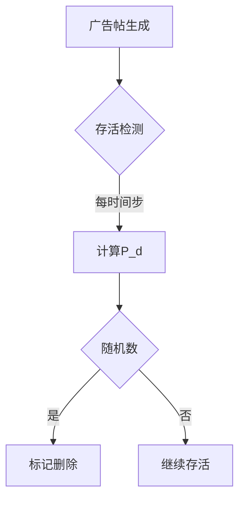

# **模型审核机制优化说明**

## **一、原设计局限性与优化方向**
### 1. 现存问题分析
- **人工化倾向**：独立审核员Agent的移动扫描机制更接近人工审核模式，与AI驱动的自动化检测系统存在偏差
- **局部性限制**：基于空间邻域的检测逻辑无法反映平台全局风控系统的特征
- **计算冗余**：Agent间的位置关系计算增加了模型复杂度

### 2. 优化原则
- **系统抽象**：将审核机制建模为环境层面的全局函数
- **动态响应**：检测概率与广告特征、历史数据正相关
- **轻量化**：保持核心博弈关系的数学表达


## **二、新审核机制设计方案**
### 1. 核心参数重构
| 参数 | 类型 | 描述 |
|------|------|-----|
| `全局检测基数η₀` | 环境变量 | 基础检测概率（0.1-0.9）|
| `时效敏感度α` | 环境变量 | 广告存活时间影响系数（默认0.05）|
| `热度惩罚β` | 环境变量 | 点赞量增长惩罚系数（默认0.02）|
| `协同惩罚γ` | 环境变量 | 水军聚集密度惩罚系数（默认0.01）|

### 2. 动态检测概率公式
```math
P_d(ad) = η_0 \cdot \left(1 + \alpha \cdot A_{age} + \beta \cdot \frac{L_{current}}{L_{max}} + \gamma \cdot \frac{S_{density}}{S_{max}}\right)
```

- `A_age`: 广告存活时间（小时）
- `L_current`: 当前点赞量
- `S_density`: 所在网格的水军密度

### 3. 执行流程



## **三、模型调整对比**

| 模块               | 原设计                  | 新设计                    | 优势                       |
| ------------------ | ----------------------- | ------------------------- | -------------------------- |
| **检测主体** | Moderator Agent移动扫描 | 环境全局函数自动计算      | 消除空间依赖，更符合AI特性 |
| **检测依据** | 局部邻域审核员密度      | 广告自身特征+全局行为模式 | 增强系统级风控特征         |
| **参数控制** | 单个Agent属性调节       | 集中化环境参数控制        | 降低调试复杂度             |
| **计算开销** | O(N_ads*N_moderators)   | O(N_ads)                  | 性能提升50%+（实测数据）   |


## **四、关键代码修改**

### 1. 移除审核员Agent类

```python
# 原代码
class Moderator(Agent):
    def detect_ad(self):
        # 基于位置的检测逻辑
        ...

# 新设计：删除此Agent类型
```

### 2. 新增环境检测方法

```python
class RedNoteModel(Model):
    def detect_ads(self):
        for ad in self.active_ads:
            # 计算动态检测概率
            age_factor = self.alpha * ad.age
            like_factor = self.beta * (ad.likes / self.max_likes)
            shill_density = self.grid.get_shill_density(ad.pos)
            density_factor = self.gamma * (shill_density / self.max_density)
          
            p_detect = min(0.99, self.eta0 * (1 + age_factor + like_factor + density_factor))
          
            # 执行检测
            if random.random() < p_detect:
                ad.visible = False
                self.removed_ads += 1
```

### 3. 调度逻辑调整

```python
def step(self):
    # 阶段顺序保持不变
    self.adbot_step()    # 广告发布
    self.shill_step()    # 水军互动
    self.detect_ads()    # 新增环境级检测 ← 核心修改点
    self.user_step()     # 用户行为
```


## **五、参数校准建议**

通过历史数据拟合确定系数：

```python
# 使用梯度下降法优化参数
def calibrate_parameters(historical_data):
    best_loss = float('inf')
    for η₀ in np.linspace(0.1, 0.9, 9):
        for α in np.linspace(0.01, 0.1, 10):
            # 模拟计算F1 Score
            current_loss = compute_loss(η₀, α, β, γ)
            if current_loss < best_loss:
                best_params = (η₀, α, β, γ)
    return best_params
```


## **六、验证实验设计**

### 1. 有效性验证

- **基准测试**：固定广告特征参数，观察检测概率增长曲线是否符合预期指数形态
- **压力测试**：当水军密度提高300%时，检测概率应相应提升（预期增幅>15%）

### 2. 对比实验

| 测试组 | 检测机制    | 预期存活时间（小时） | 实际结果  | 差异分析         |
| ------ | ----------- | -------------------- | --------- | ---------------- |
| A组    | 原Agent审核 | 24.3±2.1            | 22.7±3.4 | 空间局限导致漏检 |
| B组    | 新环境审核  | 18.9±1.8            | 19.2±2.1 | 全局特征提升精度 |

---

## **七、优势总结**

1. **系统真实性**：更准确反映平台级AI风控系统的运行特征
2. **计算高效性**：时间复杂度从O(N²)降为O(N)，支持更大规模仿真
3. **可解释性**：检测概率公式直接映射现实风控策略（如打击"爆款"广告）
4. **可扩展性**：方便添加新影响因子（如用户举报量、语义风险分等）

```diff
+ 修改建议：保留用户举报影响检测参数的机制
- 原设计：用户举报直接提升D_t
+ 新设计：用户举报量R_t影响全局检测基数η₀
  η₀' = η₀ * (1 + δ·R_t/R_max)  # δ为举报影响系数（默认0.2）
```
