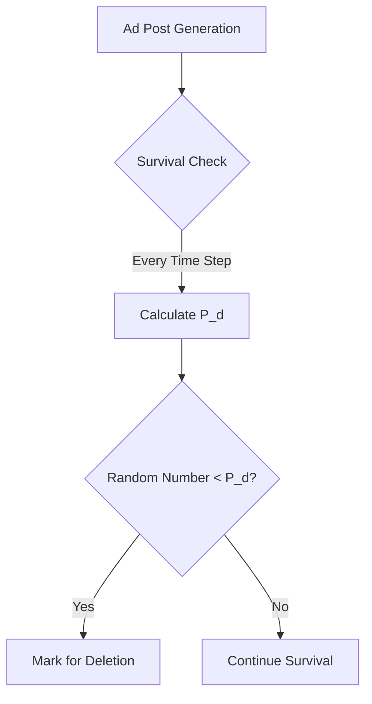

# Convert Markdown to PDF Test
## Headline test

Text *Test*: **Convert Markdown to PDF**

LaTeX Test

```math
P_d(ad) = η_0 \cdot \left(1 + \alpha \cdot A_{age} + \beta \cdot \frac{L_{current}}{L_{max}} + \gamma \cdot \frac{S_{density}}{S_{max}}\right)
```

Graph Test



