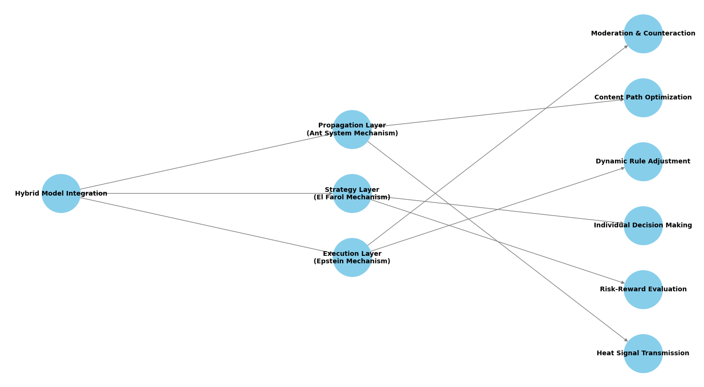

# Bot vs Guardian: Simulating Content Moderation Arms Race on Social Platforms

This **README** provides an overview of our Mesa-based simulation project, focusing on the escalating cycle of **content moderation** and **evasion tactics** in online social platforms. We adapt existing agent-based models (ABMs) from the Mesa framework—particularly those inspired by  **Epstein’s Civil Violence** ,  **Virus on Network** , and  **Schelling’s Segregation** —to model how automated moderation (guardian) and adversarial bots evolve and interact in a dynamic arms race. Our primary application scenario is a platform like  *Xiaohongshu (RedNote)* , but the design is sufficiently general to fit many social media ecosystems.

---

## 1. Research Motivation

Modern social media platforms face continual challenges in  **moderating illicit or rule-breaking content** . Whenever the platform updates detection rules (e.g., for spam, fake reviews, malicious links), adversarial **bot** strategies evolve to bypass these new constraints. Likewise, each wave of bot evasion triggers more sophisticated moderation tactics. This phenomenon mirrors an **“arms race”** or **“cat-and-mouse”** cycle, where both sides perpetually adapt and escalate.

### Key Dynamics

1. **Adaptive Bot Generation**
   * Bots employ techniques like adversarial keyword obfuscation (e.g., “sh!pping” instead of “shipping”) and AI-generated text to evade detection.
2. **Content Moderation Upgrades**
   * Moderators refine detection algorithms using graph-based analysis, advanced ML classifiers, or heuristic rules triggered by suspicious behavior.
3. **Feedback Loops**
   * Each moderation improvement prompts new bot strategies, creating cyclical spikes in evasion.
4. **User-AI Symbiosis**
   * Real users may unintentionally adopt “bot-like” posting styles or circumvent detection through coded language, further complicating detection.

---

## 2. Base Models and Adaptations

We build on **Mesa’s** **existing model library** and well-known ABM patterns to represent these social platform interactions. Below is a summary of three primary models we adapt, along with suggested modifications.

### 2.1 Epstein’s Civil Violence Model

**Original Mechanics**

* Agents (citizens) interact with authority figures (police) in a grid or network.
* Each citizen has a certain grievance/risk perception that determines whether they rebel or comply.
* Authority legitimacy influences citizens’ decisions over time.

**Proposed Adaptation**

* **Citizen Agents** → *BotAgents* that post (or refrain from posting) illicit content.
* **Police Agents** → *ModeratorAgents* that apply rules or sanctions.
* **Legitimacy** →  *Platform Trust Score* , indicating how users perceive the fairness/effectiveness of moderation.
* **Rebellion Probability** →  *Violation Probability* , i.e., how likely a bot is to post illegal/spam content.

**Additional Features**

* **Dynamic Rule Updates** : The platform (akin to “government” or “law”) periodically adjusts detection thresholds.
* **RNN-Based Violation Prediction** : Use a minimal RNN or NN-based classifier for bots to sense patterns of prior sanctions.
* **Evolutionary Tuning** : Bot behaviors evolve each cycle to maximize evasion.

---

### 2.2 Virus on Network Model

**Original Mechanics**

* A graph-based model where each node can be in susceptible/infected/recovered states.
* Infection spreads through edges until the system intervenes or nodes recover.

**Proposed Adaptation**

* **Virus** → *Illicit Content* (spam, disinformation).
* **Infection** →  *Propagation of Bot Posts* .
* **Recovery/Immunity** → *User- or AI-driven removal* of bad content.
* **Network** → *Social Graph* of user connections.

**Additional Features**

* **Multi-level Intervention** : Mitigation triggers at the user, community, and platform levels.
* **Content Mutation** : Illicit content can “mutate” (e.g., altering keywords, sentence structures) to bypass filters.
* **Dynamic Quarantines** : The model can isolate certain communities or users if infection (spam) levels get too high.

---

### 2.3 Schelling’s Segregation Model

**Original Mechanics**

* Agents (residents) move on a grid based on satisfaction thresholds tied to neighbors’ similarity.
* Clusters of like agents form over time, illustrating self-organization.

**Proposed Adaptation**

* **Residents** →  *Mixed Human-Bot Agents* .
* **Satisfaction** → *Content Match Score* (the alignment between agent interest and community norms).
* **Movement/Relocation** →  *Migration Between Communities* , as bots or users shift to other sub-forums/platforms for better infiltration or acceptance.

**Additional Features**

* **Inter-Community Influence** : Cross-platform movement or infiltration.
* **Polarization Metrics** : Track echo-chamber formation and group radicalization.
* **Hidden Preferences** : Agents might conceal real preferences to avoid detection or ostracism.

---

## 3. Secondary Reference Models

| Model                            | Mechanism to Borrow          | Use Case in Our Context                 |
| -------------------------------- | ---------------------------- | --------------------------------------- |
| **Boid Flocking**          | Coordinated group motion     | Bot swarms coordinating mass-posting    |
| **Wolf-Sheep Predation**   | Resource competition         | Mimicking “attention economy” clashes |
| **Conway’s Game of Life** | Cellular automaton evolution | Content life-cycle prediction           |

---

## 4. Technical Implementation in Mesa

Below is a code snippet showing how we might set up **ModeratorAgent** and **BotAgent** in Mesa, reflecting the **Epstein** style adaptation. The pseudo-code demonstrates:

1. **Moderator** adjusting detection rules and scanning for suspicious activity
2. **Bot** evolving its post strategies over time

```python
import mesa
import random

class ModeratorAgent(mesa.Agent):
    def __init__(self, unique_id, model):
        super().__init__(unique_id, model)
        self.detection_threshold = 0.5

    def step(self):
        self.adapt_rules()
        # Identify potential violators
        for agent in self.model.schedule.agents:
            if isinstance(agent, BotAgent):
                risk_score = self.evaluate_risk(agent)
                if risk_score > self.detection_threshold:
                    self.enforce_penalty(agent)

    def adapt_rules(self):
        # Periodically adjust detection threshold 
        if self.model.schedule.steps % self.model.rule_update_interval == 0:
            self.detection_threshold *= 1.05  # e.g., slightly tighter every update

    def evaluate_risk(self, bot):
        # Could integrate ML-based or heuristic scoring 
        return bot.behavior_score * random.random()

    def enforce_penalty(self, bot):
        bot.muted = True  # simplified penalty action
        bot.increase_evasion_pressure()

class BotAgent(mesa.Agent):
    def __init__(self, unique_id, model):
        super().__init__(unique_id, model)
        self.behavior_score = 0.3
        self.muted = False

    def step(self):
        if not self.muted:
            self.adaptive_post()

    def adaptive_post(self):
        # Generate content with some probability of detection 
        content = self.generate_adversarial_content()
        # ... post content
        self.model.record_content_posted(self, content)

    def increase_evasion_pressure(self):
        # Mimic an evolutionary strategy
        self.behavior_score += 0.1  # become more extreme in subsequent steps

    def generate_adversarial_content(self):
        # Simple placeholder for AI-based text generation
        return f"Buy now! Using code s.h!pping..."

```

---

## 5. Integration Strategy

1. **Multi-Layer Architecture**
   * **Micro-Level** : *Epstein Model* for direct agent interactions (bot vs. moderator).
   * **Meso-Level** : *Virus Model* for content spread across a social graph.
   * **Macro-Level** : *Schelling Model* for larger-scale community shift and segregation.
2. **Hybrid Network**
   ```python
   from mesa.space import NetworkGrid, ContinuousSpace

   class HybridSpace:
       def __init__(self):
           self.social_graph = NetworkGrid(...)       # Social relationships
           self.content_space = ContinuousSpace(...)  # Content attribute space
   ```
3. **Adaptive Environment**
   ```python
   class AdaptiveEnvironment:
       def __init__(self):
           self.detection_intensity = 0.7
           self.rule_update_interval = 24

       def adjust_parameters(self, performance_metrics):
           # Example dynamic update
           if performance_metrics["recall_rate"] > 0.9:
               self.detection_intensity *= 0.95
           else:
               self.detection_intensity = min(1.0, self.detection_intensity * 1.1)
   ```

---

## 6. Visualization

A possible  **multi-layer architecture diagram** :

```
+--------------------+
| Macro Layer        |  <- Schelling-based clustering
| - Community shifts |
+--------------------+
         |
         v
+--------------------+
| Meso Layer         |  <- Virus-like content spread
| - Social Graph     |
+--------------------+
         |
         v
+--------------------+
| Micro Layer        |  <- Epstein-based bot vs. moderator
| - Individual Agents|
+--------------------+
```

### Suggested Metrics for the Simulation Dashboard

1. **Oscillation Frequency** : How often bot tactics and moderator rules cycle back and forth.
2. **Strategy Evolution Entropy** : Complexity or diversity of evasive tactics over time.
3. **Detection vs. Evasion Efficiency Ratio** : Relative gains by moderation vs. adversaries each turn.
4. **System “Dissipation” Rate** : Overall cost or resource usage in the arms race.

---

## 7. How to Run

1. **Installation**

   * Clone this repository:
     ```bash
     git clone https://github.com/EECS4461/Group8.git
     cd Group8/mesa-model
     ```
   * Install dependencies:
     ```bash
     pip install -r requirements.txt
     ```
2. **Launch the Model**

   ```bash
   mesa runserver
   ```

   * Access the local web interface at [http://127.0.0.1:8521](http://127.0.0.1:8521/)
   * Configure the simulation parameters (detection thresholds, update intervals) in the UI panel
3. **Observe & Tweak**

   * Watch agent behaviors, real-time charts, and logs.
   * Adjust environment parameters to experiment with different arms-race intensities.

---

## 8. References

* **[Epstein Civil Violence Model]**

  * [Joshua M. Epstein (2002). Modeling Civil Violence: An Agent-Based Computational Approach.](https://doi.org/10.1073/pnas.092080199)
* **[Virus on Network Model]**

  * [Past Mesa example references in the official Mesa library.](https://github.com/projectmesa/mesa-examples)
* **[Schelling Segregation Model]**

  * [Thomas C. Schelling (1971). Dynamic Models of Segregation. Journal of Mathematical Sociology.
    ](https://www.tandfonline.com/doi/abs/10.1080/0022250X.1971.9989794)

---

## 9. Future Extensions

* **Cross-Modal Detection** : Incorporate image-based or video content detection.
* **Evolutionary Bot Swarms** : Extend BotAgents with group-level coordination logic akin to *Boids* or  *Wolf-Sheep Predation* .
* **User Involvement** : Model how legitimate users adapt to platform changes or inadvertently aid evasion (e.g., using coded language).

This simulation environment aims to capture the  **spiral of ban-and-breakthrough** —the never-ending cycle of moderation upgrades and adversarial strategies in content moderation on social platforms. By adapting multiple Mesa models, we hope to provide insights into emergent patterns, best-practice moderation strategies, and potential vulnerabilities.

Feel free to create issues and pull requests to refine or extend these models further!


---

### **核心模型选择与改造方案**

#### 1. **Epstein Civil Violence Model** （重点推荐）

**改造方向**：

- 将"市民-警察"映射为"违规内容-AI审核系统"
- 动态合法性参数 → 平台规则透明度指标
- 暴动阈值 → 内容传播临界值

**新增模块**：

```python
class DynamicRuleSystem:
    def __init__(self):
        self.rule_update_interval = 24  # 规则更新周期(小时)
        self.history_patterns = deque(maxlen=100)  # 历史行为模式库
      
    def evolve_rules(self):
        # 基于遗传算法的规则进化
        new_rules = crossover(self.active_rules, self.archive_rules)
        mutated_rules = mutate(new_rules, rate=0.15)
        self.active_rules = select_fittest(mutated_rules)
```

---

#### 2. **Ant System for TSP** （创新应用）

**改造方向**：

- 蚂蚁路径优化 → 内容传播路径优化
- 信息素机制 → 违规内容热度标记

**实现策略**：

```python
class ContentPheromone:
    def update_trail(self):
        # 动态调整信息素挥发率
        self.evaporation_rate = 0.2 * (1 + sin(self.model.step_count/24))
      
        # 对抗性信息素注入
        if random() < self.model.deception_prob:
            self.add_fake_trails()
```

---

#### 3. **El Farol Model** （决策机制增强）

**改造方向**：

- 餐厅选择 → 内容发布决策
- 记忆机制 → 审核结果反馈学习

**决策算法**：

```python
class PublishingStrategy:
    def decide(self):
        # 基于LSTM预测审核强度
        lstm_input = self.get_historical_data(window=72)
        detection_prob = self.lstm.predict(lstm_input)
      
        # 风险调整决策
        if detection_prob < self.risk_tolerance:
            return "publish"
        else:
            return "withhold"
```

---

### **模型集成架构**



**分层实现**：

1. **策略层** (El Farol机制)

   - 个体决策制定
   - 风险收益评估
2. **执行层** (Epstein机制)

   - 审核对抗实施
   - 规则动态调整
3. **传播层** (Ant System机制)

   - 内容路径优化
   - 热度信号传递

---

### **创新功能扩展**

#### 1. 对抗性进化记录系统

```python
class AdversarialArchive:
    def __init__(self):
        self.strategy_pool = []
        self.mutation_log = []
      
    def record_evolution(self, agent):
        # 保存策略DNA序列
        dna = hashlib.sha256(str(agent.strategy).encode()).hexdigest()
        if dna not in self.strategy_pool:
            self.strategy_pool.append(dna)
            self.mutation_log.append({
                'step': self.model.step_count,
                'parent': agent.parent_strategy,
                'mutation_type': agent.mutation_type
            })
```

#### 2. 多维度监控仪表盘

```python
class LiveDashboard:
    metrics = {
        'arms_race_index': lambda m: len(m.archive.strategy_pool),
        'detection_efficiency': lambda m: m.moderator.success_rate,
        'content_mutation_rate': lambda m: m.stats.mutation_count/m.step_count
    }
  
    def render_3d(self):
        # 三维可视化对抗轨迹
        plotly_data = {
            'x': [log.arms_race_index for log in self.history],
            'y': [log.detection_efficiency for log in self.history],
            'z': [log.content_mutation_rate for log in self.history]
        }
        return px.line_3d(plotly_data)
```

---

### **实验设计建议**

| 维度         | 变量范围 | 观测指标         |
| ------------ | -------- | ---------------- |
| 规则更新频率 | 6-72小时 | 策略池多样性指数 |
| 记忆衰减率   | 0.1-0.9  | 决策滞后周期     |
| 信息素灵敏度 | 0.01-1.0 | 传播路径迂回度   |
| 突变概率     | 5%-25%   | 有效策略存活率   |

---

### **验证方案**

1. **历史数据回测**使用微博/Reddit公开审核日志验证模型行为模式
2. **对抗强度压力测试**

```python
def stress_test():
    for intensity in [0.3, 0.6, 0.9]:
        model = ModerationModel(detection_intensity=intensity)
        while model.running:
            model.step()
        analyze_phase_transition(model)
```

3. **消融实验设计**

```python
ablation_configs = [
    {'rule_evolution': False},
    {'pheromone_system': False},
    {'memory_mechanism': False}
]
```

---

通过这种深度改造方案，您将获得：
✅ 支持动态规则演化的审核系统模拟
✅ 具备自学习能力的对抗策略生成
✅ 多层级传播路径优化机制
✅ 可视化分析对抗进化轨迹

建议首先基于Epstein模型构建核心对抗机制，逐步集成Ant System的路径优化和El Farol的决策学习模块。可参考Mesa的模块化设计模式，保持各组件解耦以便独立调试。

---

### **核心适配模型**

#### 1. **Epstein Civil Violence Model**

**原模型机制**：

- 市民与警察的双向互动
- 基于风险感知的行为决策
- 动态合法性评估系统

**改造方向**：

- 市民 → 违规内容发布者（BotAgent）
- 警察 → 内容审核AI（ModeratorAgent）
- 合法性 → 平台信任度指标
- 暴动概率 → 内容违规风险系数

**新增功能**：

- 添加动态规则更新模块
- 实现基于RNN的违规模式预测
- 构建行为模式进化树

---

#### 2. **Virus on Network Model**

**原模型机制**：

- 网络拓扑结构传播
- 感染/免疫状态转换
- 病毒传播阈值控制

**改造方向**：

- 病毒 → 违规内容
- 免疫 → 用户举报机制
- 传播网络 → 社交关系图谱

**新增功能**：

- 添加多层级传播抑制（社区/用户/内容）
- 实现内容变异传播机制
- 构建动态隔离策略模块

---

#### 3. **Schelling Segregation Model**

**原模型机制**：

- 基于相似性偏好的空间聚集
- 满意度阈值驱动迁移
- 自组织模式形成

**改造方向**：

- 居民 → 用户/机器人混合体
- 满意度 → 内容匹配度
- 迁移 → 社区跳转行为

**新增功能**：

- 添加跨社区影响力传播
- 实现动态群体极化指标
- 构建隐性偏好学习机制

---

### **辅助参考模型**

| 模型                           | 可借鉴机制   | 改造用例           |
| ------------------------------ | ------------ | ------------------ |
| **Boid Flocking**        | 群体协调策略 | 机器人协同攻击模式 |
| **Wolf-Sheep Predation** | 资源竞争动态 | 流量争夺模拟       |
| **Conways Game of Life** | 网格演化规则 | 内容存活周期预测   |

---

Create and activate a [virtual environment](http://docs.python-guide.org/en/latest/dev/virtualenvs/).  *Python version 3.11 or higher is required* .

Install Mesa:

```bash
pipinstall--upgrademesa[rec]
```

If you want to use our newest features, you can also opt to install our latest pre-release version:

```bash
pipinstall--upgrade--premesa[rec]
```

Install Jupyter notebook (optional):

```bash
bpipinstalljupyter
```

Install [Seaborn](https://seaborn.pydata.org/) (which is used for data visualization):

```bash
pipinstallseaborn
```

**If running in Google Colab run the below cell to install Mesa.** (This will also work in a locally installed version of Jupyter).

---

CHANGE THE NEXT CELL to code if you are in Google COLAB

## Building the Sample Model

After Mesa is installed a model can be built. A jupyter notebook is recommended for this tutorial, this allows for small segments of codes to be examined one at a time.

### Creating Model With Jupyter notebook

Write the model interactively in [Jupyter](http://jupyter.org/) cells.

Start Jupyter:

```
jupyterlab
```

Create a new notebook named `money_model.ipynb` (or whatever you want to call it).

### Creating Model With Script File (IDE, Text Editor, Colab, etc.)

Create a new file called `<money_model.py` (or whatever you want to call it)

*Code will be added as the tutorial progresses.*

**Good Practice:** Place a model in its own folder/directory. This is not specifically required for the starter_model, but as other models become more complicated and expand multiple python scripts, documentation, discussions and notebooks may be added.

### Import Dependencies

This includes importing of dependencies needed for the tutorial.

```python
importmesa

# Data visualization tools.
importseabornassns

# Has multi-dimensional arrays and matrices. Has a large collection of
# mathematical functions to operate on these arrays.
importnumpyasnp

# Data manipulation and analysis.
importpandasaspd
```

### **关键改造技术栈**

```python
class ModeratorAgent(mesa.Agent):
    def __init__(self, unique_id, model):
        super().__init__(unique_id, model)
        self.detection_model = self.load_ml_model()  # 加载检测模型
  
    def step(self):
        # 动态规则更新
        self.adapt_rules(self.model.rule_update_interval)  
  
        # 网络拓扑分析
        suspicious_nodes = self.analyze_network_centrality()
  
        # 对抗性检测
        for agent in self.model.schedule.agents:
            if isinstance(agent, BotAgent):
                risk_score = self.calculate_risk(agent)
                if risk_score > self.threshold:
                    self.apply_sanction(agent)

class BotAgent(mesa.Agent):
    def evolutionary_strategy(self):
        # 遗传算法优化策略
        if self.model.step_count % 72 == 0:  # 72小时进化周期
            self.mutate_behavior()
            self.crossover_strategies()
      
    def adaptive_post(self):
        # 生成对抗性内容
        adversarial_content = self.generator.create(
            evasion_level=self.model.detection_intensity,
            context_awareness=self.social_graph.analyze()
        )
        self.post_content(adversarial_content)
```

---

### **模型集成建议**

1. **多层架构设计**

   - **微观层**：Epstein模型处理个体交互
   - **中观层**：Virus模型处理信息传播
   - **宏观层**：Schelling模型处理群体演化
2. **混合网络拓扑**

```python
from mesa.space import NetworkGrid, ContinuousSpace

class HybridSpace:
    def __init__(self):
        self.social_graph = NetworkGrid()  # 社交关系网络
        self.content_space = ContinuousSpace()  # 内容特征空间
```

3. **动态参数调节器**

```python
class AdaptiveEnvironment:
    def __init__(self):
        self.detection_intensity = 0.7  # 初始检测强度
        self.rule_update_interval = 24  # 规则更新周期(小时)
  
    def adjust_parameters(self):
        # 基于系统表现动态调整
        if self.recall_rate > 0.9:
            self.detection_intensity *= 0.95
        else:
            self.detection_intensity = min(1.0, self.detection_intensity*1.1)
```

---

### **可视化方案**

**监测仪表盘建议指标**：

1. 对抗周期振荡频率
2. 策略进化熵值
3. 检测-规避效率比
4. 系统耗散率

通过组合使用这些模型，可以构建出反映真实社交媒体内容治理动态的复杂适应系统模拟环境。建议优先从Epstein模型的警民对抗机制入手，逐步集成网络传播和群体演化特征。
